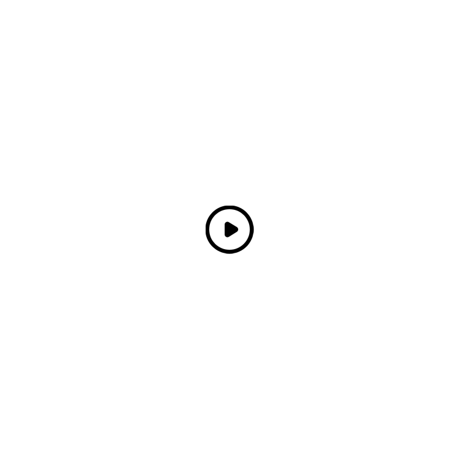

## Mindar.JS使用方式

>**注意：此篇文章需要启动https才可调用相机权限**
#### 图像追踪示例
1. 需要用到两个js库
```html
    <script src="./js/aframe.min.js"></script>
    <script src="./js/mindar-image-aframe.prod.js"></script>
```
地址稍后放上
2. 下面看一下标签结构


这里是默认配置
```js
    document.addEventListener("DOMContentLoaded", function () {
      const sceneEl = document.querySelector('a-scene');
      let arSystem;
      sceneEl.addEventListener('loaded', function () {
        // alert('执行')
        arSystem = sceneEl.systems["mindar-image-system"];

      });
      const startButton = document.querySelector("#example-start-button");
      startButton.addEventListener('click', () => {
        console.log("start");
        arSystem.start(); // start AR 
        arSystem.pause(true);
      });
      sceneEl.addEventListener("arReady", (event) => {
        alert('AR引擎已启动')
      });
      sceneEl.addEventListener("arError", (event) => {
        alert('相机未启动成功！')
      });
    });
```
上面图片提到需要一个Mind文件，这个文件就是图像识别的图片，工具在这里[图像目标编辑器](https://hiukim.github.io/mind-ar-js-doc/tools/compile)

## 图像目标编辑器


如果是图片识别显示图片的话就很简单了
## 关于渲染视频
如果我想扫描图片展示视频该如何去操作呢？
我这里加了两张png图片用来做暂停按钮


我这里按顺序称谓`opc.png背景`，`2.png按钮`
当我们点击`背景`时让视频暂停，并让`按钮`层级往内移动 或者 让`按钮`隐藏
再次点击`背景`让视频播放，让`按钮`显示

```js
const portfolio = document.querySelector("#portfolio-panel");
    const paintandquestPreviewButton = document.querySelector("#paintandquest-preview-button");
    const paintandquestPreviewButton2 = document.querySelector("#paintandquest-preview-button2");
    portfolio.setAttribute("visible", true);
    let y = 0;
    let status = false;
    paintandquestPreviewButton.addEventListener('click', () => {
      if (status == false) {
        // paintandquestPreviewButton.setAttribute("visible", false);
        const testVideo = document.createElement("video");
        const canplayWebm = testVideo.canPlayType('video/webm; codecs="vp8, vorbis"');
        if (canplayWebm == "") {
          document.querySelector("#paintandquest-video-link").setAttribute("src", "#paintandquest-video-mp4");
          document.querySelector("#paintandquest-video-mp4").play();
        } else {
          paintandquestPreviewButton2.setAttribute("visible", false);
          document.querySelector("#paintandquest-video-link").setAttribute("src", "#paintandquest-video-mp4");
          document.querySelector("#paintandquest-video-mp4").play();
          // alert('播放')
          status = true
        }
      } else {
        paintandquestPreviewButton2.setAttribute("visible", true);
        // alert('暂停')
        // portfolio.setAttribute("visible", true);
        document.querySelector("#paintandquest-video-mp4").pause();

        status = false;
      }
    });
    portfolio.setAttribute("position", "0 " + y + " -0.01");
```

完整代码：
```html
<!--
 * @Description: 
 * @Autor: Southern Wind
 * @Date: 2023-07-25 11:21:40
 * @LastEditors: Southern Wind
 * @LastEditTime: 2023-07-25 12:00:42
-->
<!DOCTYPE html>
<html lang="en">

<head>
  <meta charset="UTF-8">
  <meta name="viewport" content="width=device-width, initial-scale=1.0">
  <title>AR相机</title>
  <script src="./js/aframe.min.js"></script>
  <script src="./js/mindar-image-aframe.prod.js"></script>

  <script src="./js/vconsole.min.js"></script>
</head>

<body>
  <div style="position: absolute; z-index: 1000">
    <button id="example-start-button">重新加载</button>
  </div>
  <a-scene mindar-image="imageTargetSrc: ./targets.mind;" vr-mode-ui="enabled: false" device-orientation-permission-ui="enabled: false">
    <a-assets>
      
      
      <video id="paintandquest-video-mp4" autoplay="false" loop="true" src="./1234.mp4" playsinline webkit-playsinline></video>

    </a-assets>

    <a-camera position="0 0 0" look-controls="enabled:  false" cursor="fuse: false; rayOrigin: mouse;" raycaster="far: 10000; objects: .clickable"></a-camera>
    <a-entity mindar-image-target="targetIndex: 0" mytarget>
      <a-entity visible=false id="portfolio-panel" position="0 0 -0.01">
        <a-image id="paintandquest-preview-button" class="clickable" src="#paintandquest-preview" alpha-test="0.5" position="0 0 0.1" height="0.552" width="1">
        </a-image>
        <a-image id="paintandquest-preview-button2" class="clickable" src="#paintandquest-preview2" alpha-test="0.5" position="0 0 0.05" height="0.552" width="1">
        </a-image>
        <a-video id="paintandquest-video-link" webkit-playsinline playsinline width="1" height="0.552" position="0 0 0"></a-video>
      </a-entity>
    </a-entity>
  </a-scene>
  <script>
    const vConsole = new VConsole()
    console.log(vConsole);
  </script>
  <script>
    const portfolio = document.querySelector("#portfolio-panel");
    const paintandquestPreviewButton = document.querySelector("#paintandquest-preview-button");
    const paintandquestPreviewButton2 = document.querySelector("#paintandquest-preview-button2");
    portfolio.setAttribute("visible", true);
    let y = 0;
    let status = false;


    paintandquestPreviewButton.addEventListener('click', () => {
      if (status == false) {
        // paintandquestPreviewButton.setAttribute("visible", false);
        const testVideo = document.createElement("video");
        const canplayWebm = testVideo.canPlayType('video/webm; codecs="vp8, vorbis"');
        if (canplayWebm == "") {
          document.querySelector("#paintandquest-video-link").setAttribute("src", "#paintandquest-video-mp4");
          document.querySelector("#paintandquest-video-mp4").play();
        } else {
          paintandquestPreviewButton2.setAttribute("visible", false);
          document.querySelector("#paintandquest-video-link").setAttribute("src", "#paintandquest-video-mp4");
          document.querySelector("#paintandquest-video-mp4").play();
          // alert('播放')
          status = true

        }
      } else {
        paintandquestPreviewButton2.setAttribute("visible", true);
        // alert('暂停')
        // portfolio.setAttribute("visible", true);
        document.querySelector("#paintandquest-video-mp4").pause();

        status = false;
      }

    });
    portfolio.setAttribute("position", "0 " + y + " -0.01");


    document.addEventListener("DOMContentLoaded", function () {
      const sceneEl = document.querySelector('a-scene');
      let arSystem;
      sceneEl.addEventListener('loaded', function () {
        // alert('执行')
        arSystem = sceneEl.systems["mindar-image-system"];

      });
      const startButton = document.querySelector("#example-start-button");
      startButton.addEventListener('click', () => {
        console.log("start");
        arSystem.start(); // start AR 
        arSystem.pause(true);
      });
      sceneEl.addEventListener("arReady", (event) => {
        alert('AR引擎已启动')
      });
      sceneEl.addEventListener("arError", (event) => {
        alert('相机未启动成功！')
      });
    });
  </script>

</body>

</html>
```
实际效果：

